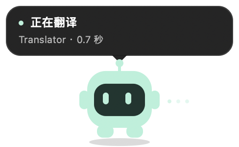

# Translator for Codex

在 Codex 中输入中文，写好后点击宠物，整段转换成英文。

Translator 是一个轻量的 macOS / Windows 桌面伴侣：保留你习惯的中文输入法，通过一个可拖动的小宠物控制翻译。输入和修改完成后，由你点击宠物触发一次翻译：工具检查当前输入框，调用你配置的 API 整段翻译，再将英文填回消息草稿。

<p align="center">
  
</p>

> 当前为 **macOS / Windows 实验版本**，仅适配 Codex 桌面应用的普通文本输入框。Windows 版已在 Windows 11 上完成设置试译及 Ctrl+T 填回 Codex 的用户实测；输入法兼容性仍在验证中。本项目是独立工具，与 OpenAI 无官方关联。

## 功能

- **中文输入，英文草稿**：一次翻译完整草稿，避免逐词拼接影响语义。
- **人来决定翻译时机**：每次点击只翻译一次，不因停顿、重新聚焦或继续输入自动请求。
- **看得见的翻译状态**：宠物显示等待点击、选词提示、正在翻译、完成和错误等状态。
- **可拖动的桌面宠物**：记住拖动后的位置，输入框高度变化时保持原位。
- **自定义 API**：支持兼容 Chat Completions 的服务，可填写地址、模型名称和 Key。
- **本地保存设置**：地址、模型和 Key 在重启后恢复，无需重复填写。
- **保护正在编辑的内容**：继续输入、移动选区或切换焦点时取消旧结果；正在选词时提示先完成选词，再次点击才会翻译。
- **保留代码和链接**：代码块、行内代码和 URL 使用占位保护；模型破坏占位符时保留原稿。

工具只修改草稿，发送消息仍由你操作。翻译质量和响应速度取决于所选模型与 API 服务。

## 两个平台怎么用

两端都采用 **写完后手动翻译整段**：确认中文候选词 → 点击 Codex 输入框 → 点击宠物或按 `Ctrl+T` → 检查英文 → 自己发送。不会按输入停顿自动翻译，也不会自动发送消息。光标可以在段落中间。

| 操作 | macOS | Windows |
| --- | --- | --- |
| 打开应用 | 访达「应用程序」中的 `Translator.app`，或 Spotlight | 桌面 / 开始菜单的 Translator，或完整解压目录中的 `Translator.exe` |
| 首次设置 | 保存 API 地址、模型、Key，点击「试译」；为 Translator 授予辅助功能权限 | 保存 API 地址、模型、Key，点击「试译」；两款应用以普通用户运行 |
| 翻译整段 | 点击宠物，或 **Control + T**（不是 Command + T） | 点击宠物，或 **Ctrl + T** |
| 恢复上一次原文 | **Control + Option + R** | **Ctrl + Alt + R** |
| 打开设置 / 退出 | 菜单栏「译」 | 点击任务栏 Translator 图标恢复设置；托盘菜单可退出 |
| 找不到宠物 | 设置或菜单栏 →「找回翻译宠物」 | 托盘菜单 →「找回翻译宠物」 |
| 移动宠物 | 鼠标拖动，位置会保存 | 鼠标拖动，位置会保存 |

恢复原文要求译文没有被继续修改。Windows 关闭设置窗口或返回 Codex 时，会最小化到任务栏，保留图标供你再次打开设置；macOS 关闭设置后仍在菜单栏运行。要完全退出，请使用菜单栏 / 托盘的退出选项。宠物在 Codex 位于前台时显示，翻译快捷键也只在 Codex 前台时占用。

## 快速开始

### Windows 11 x64 预览版

解压完整应用包后，双击 **Translator.exe** 即可运行；双击 **Install.cmd** 可安装并创建桌面和开始菜单快捷方式。设置在应用窗口内打开；点击关闭或返回 Codex 后，窗口最小化并保留任务栏图标，点击该图标即可恢复设置。托盘菜单仍提供退出入口。无需安装 Go、.NET SDK 或打开终端。

应用需要 .NET Framework 4.8 和 Microsoft Edge WebView2 Runtime；已在测试机器上使用现有运行时启动。填入服务配置并试译后，回到 Codex，完成中文选词，再点击宠物或按 **Ctrl+T**。**Ctrl+Alt+R** 恢复最近一次替换前的草稿。

Windows 无需 macOS 的辅助功能授权；Codex 与 Translator 应均以普通用户运行。目前识别 Microsoft Store 安装的 Codex。应用安装在 `%LOCALAPPDATA%\Programs\TranslatorForCodex`，配置及明文 Key 保存在 `%LOCALAPPDATA%\CodexTranslator`，由当前用户的目录 ACL 保护。

Windows 构建、诊断和测试说明见 [native/windows/README.md](native/windows/README.md)。应用包尚未代码签名。

### macOS 环境要求

| 项目 | 要求 |
| --- | --- |
| 系统 | macOS 13 或更新版本 |
| 目标应用 | Codex 桌面应用 |
| 编译工具 | Go 1.24+、Swift、Xcode Command Line Tools |
| 翻译服务 | 兼容 Chat Completions 的 API |
| 已适配输入源 | macOS 系统简体拼音、ABC、US |

Go 核心仅使用标准库；原生界面使用系统 AppKit 和 WebKit，无需 Electron 或 Node.js 运行时。构建脚本生成当前机器架构的应用。

### 从源码构建

获取源码并进入项目目录：

```sh
git clone https://github.com/raoniaaa/TranslatorForCodex.git
cd TranslatorForCodex
```

然后构建应用：

```sh
# 若尚未安装 Xcode Command Line Tools
xcode-select --install

# 构建并启动
./scripts/build-macos.sh
./scripts/install-macos.sh
open /Applications/Translator.app
```

构建产物位于 `dist/`，安装脚本将应用复制到 `/Applications/Translator.app`。以后可从访达的「应用程序」或 Spotlight 搜索 Translator 打开。设置窗口打开时显示 Dock 图标；关闭窗口后，工具仍在菜单栏运行。再次打开应用或点击菜单栏的「译」可返回设置，退出后也可从「应用程序」重新启动。更新安装前请先退出旧版本。

### 配置翻译服务

1. 在设置中填写 API 地址、模型名称和 API Key，点击「保存设置」。
2. 输入一段中文并点击「试译」，确认服务可用。
3. **仅 macOS**：前往「系统设置 → 隐私与安全性 → 辅助功能」，为 **Translator** 授权。Windows 不需要此权限。
4. 点击「前往 Codex · 显示宠物」，回到输入框；写好中文后点击宠物翻译整段草稿。

API 地址支持以下形式：

```text
https://your-provider.example/v1
https://your-provider.example/v1/chat/completions
http://127.0.0.1:8000/v1
```

远程服务需要 HTTPS，本机服务允许 HTTP。模型名称必须与服务提供的名称一致。无需鉴权的本机服务可以留空 Key。

### 日常使用

1. 正常输入中文、移动光标并修改内容，工具不会因停顿而开始翻译。
2. 写好后点击宠物，或按 **Control + T**，翻译当前输入框中的整段草稿。
3. 检查填回的英文，照常发送。

**光标不需要移到末尾。** 即使光标在中间或有选区，点击也会翻译整个输入框，而非仅翻译选中的部分。写入前会核对点击时的文本与选区；若请求期间继续编辑、移动光标或切换焦点，旧结果会取消，需要再次点击。

正在选词、输入法不受支持或草稿包含未闭合的代码块时，本次点击会提示原因，不会把翻译排队到稍后。翻译中重复点击不会累积多次请求。

| 操作 | 效果 |
| --- | --- |
| 点击宠物 | 检查当前输入框并翻译整段草稿一次 |
| 拖动宠物 | 移动并保存位置，不触发翻译 |
| 右键宠物 | 打开设置或重新定位；macOS 还可检查权限 |
| `Control + T` | 翻译当前整段草稿一次 |
| macOS `Control + Option + R` / Windows `Ctrl + Alt + R` | 恢复最近一次替换前的草稿，前提是草稿未再修改 |

设置页的「前往 Codex · 显示宠物」会收起设置窗口并返回 Codex；macOS 若能唯一确定输入框，会自动聚焦它；Windows 返回 Codex 后，请点击消息输入框。此操作不修改草稿。写完后仍需点击宠物或按 `Control + T`。

Codex 在前台时宠物保持可见，未识别到输入框时会提示先点击输入框。找不到宠物时，点击设置页或菜单栏「译」里的「找回翻译宠物」，可重置位置并回到 Codex。菜单栏和 Windows 托盘也提供「取消本次翻译」。

## 数据与本地存储

应用直接请求你配置的翻译服务，待翻译的草稿会发送到该服务；本项目不提供中转服务。Key 用于该服务的请求鉴权，不会出现在设置状态接口中。

默认配置目录：

| 平台 | 目录 |
| --- | --- |
| macOS | `~/Library/Application Support/CodexTranslator/` |
| Windows | `%LOCALAPPDATA%\CodexTranslator\` |

两个平台使用相同的设置与密钥文件结构。macOS 示例：

```text
~/Library/Application Support/CodexTranslator/
├── settings.json          # API 地址、模型、密钥文件引用
└── credentials/
    └── <id>.key           # API Key
```

- **Key 以明文保存在本地文件，不使用 macOS 钥匙串或 Windows 凭据管理器。** macOS 密钥目录权限为 `0700`，密钥文件和设置文件权限为 `0600`；Windows 由当前用户的目录 ACL 保护。
- Key 输入框保存后清空，界面以保存状态提示；同一服务留空保存会保留原 Key。
- 切换 API 主机不会自动沿用旧 Key；可在设置中删除已保存的 Key。
- 草稿和译文仅保留在本次进程内存中，应用不写入翻译历史日志。
- 不读取 Codex 登录凭据，不自动发送消息。

本地设置网页仅监听 `127.0.0.1`，使用随机会话路径、Host / Origin 校验和 CSP。模型请求拒绝自动重定向。

## 已知限制

- **目前仅针对 Codex 普通文本输入框。** Windows 新增原生预览版，其他桌面应用尚未适配。
- **输入法状态检测属于实验功能。** macOS 当前通过候选浮窗判断选词状态；Windows 使用 UI Automation TextEdit 组合态接口。候选窗隐藏、输入法行为变化或 Codex 升级可能影响判断。
- **首版针对普通文本草稿。** 附件、提及和复杂富文本组合不在已验证范围内，工具会对检测到的不支持内容暂停处理。
- **整段写入依赖辅助功能接口。** 写入前会重新核对草稿和选区，写入后最多校正一次光标；若编辑器未接受定位，需手动点击文本末尾。
- **尚未签名分发或公证。** macOS 默认构建使用本机 ad-hoc 签名，Windows 应用包未签名，适合从源码构建测试，不是已完成安装分发的正式版本。

## 常见问题

### macOS 已经授予辅助功能权限，仍提示未授权

给 Codex 授权不等于给 Translator 授权。**同一安装版本正常退出重开不需要重复授权**；但本机 ad-hoc 签名可能在重新构建、替换入口或更改安装位置后使旧授权失效。

在辅助功能设置中移除旧 Translator，使用应用设置页的「定位当前应用」找到新版本并重新添加，再点击「重新检测权限」。

### 为什么停顿后没有翻译？

当前采用点击触发：写好后点击宠物或按 `Control + T`。请确保服务试译成功、macOS 辅助功能权限生效，且当前焦点位于 Codex 普通消息输入框。光标可以在任何位置。

API 请求失败或输入状态改变后不会自动重试；检查草稿后再次点击宠物即可。

### Windows 按 Ctrl+T 没有翻译怎么办？

先确认设置页「试译」成功，然后回到 Codex 的消息输入框，按空格或回车完成中文选词，再按 `Ctrl+T` 或点击宠物。快捷键被其他程序占用时可直接点击宠物。若提示仍在选词，请确认候选框已经关闭，并重新点击输入框再试；不要在候选框打开时触发翻译。

请让 Translator 和 Codex 都以普通用户运行。目前适配 Microsoft Store 版 Codex，其他安装来源尚未验证。测试时切换窗口、弹出控制台会影响焦点与选词状态；诊断脚本不会写入草稿。

### 为什么更换模型后，译文风格或速度不同？

Translator 使用你配置的模型完成翻译。工具会要求保留语义、否定关系、段落和技术术语，但实际质量与延迟由服务和模型决定。可以先在设置页试译，再使用点击填回。

## 开发

```sh
# Go 测试与静态检查
go test -race ./...
go vet ./...

# 构建 macOS 应用
./scripts/build-macos.sh

# 仅启动设置与试译网页，不连接桌面
go run ./cmd/translator --demo
```

网页模式会在终端打印临时本地地址。可用 `python3 scripts/mock_api.py` 启动固定响应测试服务；将它输出的地址填入试译设置，模型填写 `fixture` 可测试成功响应，填写 `fixture-error` 可测试 HTTP 503。该服务不调用真实模型，不用于评价译文质量。

| 环境变量 | 用途 |
| --- | --- |
| `TRANSLATOR_CONFIG_DIR` | 自定义设置目录，测试时可隔离真实配置 |
| `TRANSLATOR_BASE_URL` | 覆盖本次运行的 API 地址 |
| `TRANSLATOR_MODEL` | 覆盖本次运行的模型名称 |
| `TRANSLATOR_API_KEY` | 从进程环境传入 Key |
| `TRANSLATOR_SIGNING_IDENTITY` | 构建时指定代码签名身份，默认 `-`（ad-hoc） |

Go 测试覆盖仅点击触发、任意光标位置、重复点击、选词阻塞、过期结果丢弃、焦点变化、撤销保护、API 响应处理以及本地配置保存与恢复。Windows 原生适配器及 Go 后端的隔离测试见 [Windows 开发说明](native/windows/README.md)。原生输入法和光标行为仍需按系统、输入法和 Codex 版本实测。

### 项目结构

```text
cmd/translator/          # 应用入口
internal/engine/         # 翻译状态机与替换保护
internal/provider/       # Chat Completions 请求与代码/链接保护
internal/credentials/    # 本地密钥文件存储
internal/desktop/        # Go 与原生助手通信
internal/web/            # 本地设置服务与 Web UI
native/macos/            # AppKit 原生入口、后台服务管理、菜单栏与宠物
native/windows/          # WPF 原生入口、WebView2 设置、托盘与宠物
scripts/                 # 构建脚本与测试服务
docs/images/             # README 截图
```

构建产物 `dist/`、本地配置、密钥文件和日志已列入 `.gitignore`。提交问题时，请附上系统版本、输入法和复现步骤，并隐去 Key 与私人草稿。
